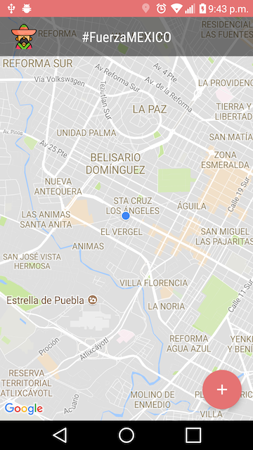
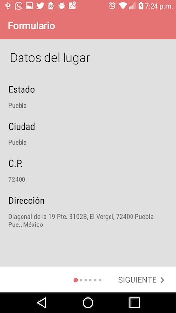

# Adqusición de Datos de Desastres - #FuerzaMexico

Se trata de una aplicación móvil de colaboración para la captura de puntos afectados por los sismos del 2017

Este esfuerzo intenta ser una respuesta rápida a las necesidades de varias organizaciones y ciudadanos del estado de Puebla que ya están en campo realizando diferentes actividades de apoyo pero los medios de comunicación que utilizan generan duplicidad de información o no actualizada.

Nota 1: Por el momento estamos siguiendo la estructura e información de #Verificado19s conforme avance ese proyecto veremos como integramos nuestra información.

Nota 2: Se están creando herramientas de ETL para sincronizar la información con https://mapa.sismomexico.org/

Desarrolladores principales:

* Michael Aca <michael@kimetrics.com>
* Francisco Javier Peña <francisco@kimetrics.com>

Colaboradores
* Alondra Ramirez <alondrard@kimetrics.com>
* David Ruiz <david@kimetrics.com>
* Gerardo de la Rosa <gerardo@kimetrics.com>
* Erik Rivera <erik@kimetrics.com>

Gracias a Kimetrics que está donando tiempo de desarrollo para este proyecto.

# Capturas de pantalla

